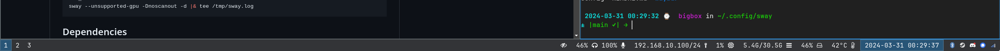

# SwayWM Config



## Registering Sway with GDM (Nvidia)

Add the following to `/usr/share/wayland-session/sway-nvidia.desktop`.

```shell
[Desktop Entry]
Name=Sway (nvidia)
Comment=An i3-compatible Wayland compositor
Exec=sway-nvidia
Type=Application
```

Add the following to `/usr/bin/sway-nvidia`.

```shell
export XDG_SESSION_TYPE=wayland
export XDG_SESSION_DESKTOP=sway
export XDG_CURRENT_DESKTOP=gnome

cp -f /tmp/sway.log /tmp/sway.log.old

env \
WLR_RENDERER=vulkan \
WLR_NO_HARDWARE_CURSORS=1 \
GBM_BACKEND=nvidia-drm \
sway --unsupported-gpu -Dnoscanout -d |& tee /tmp/sway.log
```

## Dependencies

### Fedora

```shell
sudo dnf install waybar kanshi jq grimshot wdisplays mako
```

## Platform Specific Modifications

Add the following to `~/.config/environment.d/envvars.conf`.

```shell
SSH_AUTH_SOCK=${XDG_RUNTIME_DIR}/ssh-agent.socket
```

Create a `60-display.conf` file.

```shell
sudo chown ${USER} /etc/sway/config.d
sudo touch /etc/sway/config.d/60-display.conf
```

Add the following to the newly create `60-display.conf` file.

```shell
exec dbus-update-activation-environment \
    --systemd WAYLAND_DISPLAY \
    DISPLAY SWAYSOCK \
    XDG_SESSION_TYPE=wayland \
    XDG_CURRENT_DESKTOP=gnome \
    XDG_SESSION_DESKTOP=sway

exec "ssh-agent -a $SSH_AUTH_SOCK"
```

## Configuring Displays

Adjust displays to desired configuration. Apply the configuration, and then
use `get_outputs` to obtain information for Kanshi config.

```shell
wdisplays
swaymsg -t get_outputs
```

Example Kanshi config:

~/.config/kanshi/config

```shell
profile "multiple" {
    output DP-4 mode 2560x1440@59.951Hz position 0,0 adaptive_sync off
    output DP-5 mode 2560x1440@59.951Hz position 0,1440 adaptive_sync off
}
```

With Nvidia, it's recommended to disable adaptive_sync.

### Setting up Waybar

```
ln -sfn ~/.config/sway/waybar ~/.config/waybar
```
